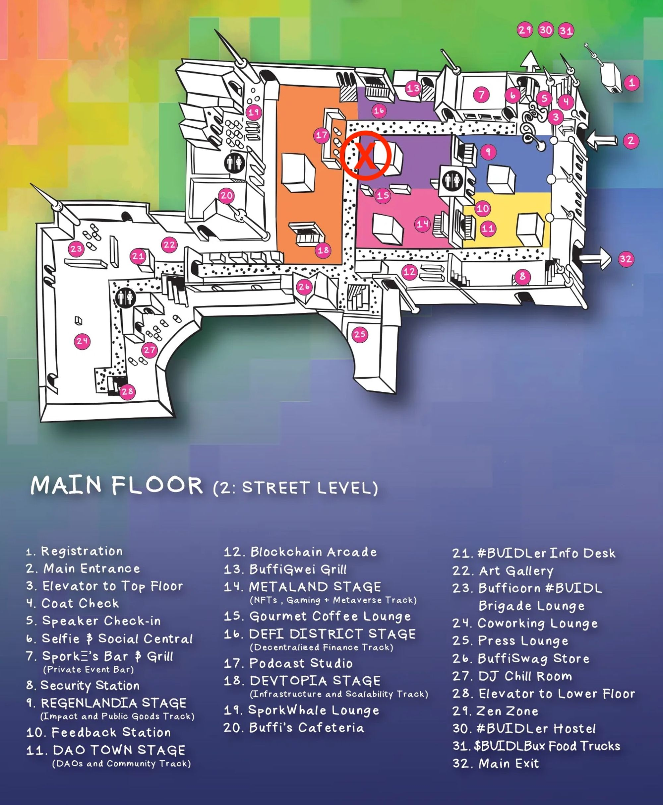

**The RISC Zero team is out in full force for ETHDenver! Come to our talks, booth, and developer meetup to learn more about what we have been hard at work building.** 

# Bonsai

**The RISC Zero team is excited to announce:** **Bonsai our Zero-Knowledge Proving Network**

Bonsai is a general-purpose zero-knowledge proving network that allows for any chain, any protocol, and any application to take advantage of ZK proofs for scaling, privacy, and more. With Bonsai, ZK proof integration into ETH, L1 Blockchains, Cosmos App Chains, L2 Rollups, DApps etc. is possible in a matter of days with minimal development effort. **Bonsai is a new kind of blockchain: a massively parallel, chain-agnostic, and general-purpose network designed to allow application developers to build new classes of applications.**

Our RISC-V zkVM acts as the foundations of Bonsai and enables wide spread language compatibility with the potential for zero-knowledge provable code written in Rust, C++, Solidity, Go, and more. With a combination of recursive proofs, a bespoke circuit compiler, state continuations, and continuous improvements to the proving algorithm, Bonsai enables anyone to generate highly performant ZK proofs for a variety of applications. 

Bonsai combines three key ingredients to produce a unique network that will enable new classes of applications to be developed across blockchain and traditional application domains:

- A general-purpose zkVM capable of running any VM in a ZK/verifiable context
- A proving system that directly integrates into any smart contract or chain
- A universal rollup that distributes any computations proven on Bonsai to every chain

**Bonsai effectively allows for any application, blockchain, and appchain to easily integrate ZK proofs into their protocol without any custom ZK circuit development. This will enable a paradigm shift in how ZK proofs are used across the entire blockchain ecosystem.**

**The Bonsai Litepaper can be found [AT THIS LINK](https://dev.bonsai.xyz/litepaper).**

🚀[**Get notified when Bonsai is released to the public**](https://fmree464va4.typeform.com/to/t6hZD54Z)🚀

The ETHDenver Bonsai Developer Website can be found **[AT THIS LINK](https://dev.bonsai.xyz/).**

💡 **Early alpha access to Bonsai is currently controlled via a Whitelist.   
💡 Developers looking to join the Bonsai Whitelist may fill out the form [HERE](https://m1emhs1gxzc.typeform.com/to/wHuXlEpW)**

# zkVM

**[One Page Overview](https://dev.bonsai.xyz/learn-zkvm)**

The RISC Zero zkVM is an open-source, zero-knowledge virtual machine that lets you build trustless, verifiable software in your favorite languages. The zkVM bridges the gap between zero-knowledge proof (ZKP) research and widely-supported programming languages such as C++ and Rust. ZKP technology enables programs' outputs to be checked for correctness by someone who cannot see its inputs. This verifiability enables game changing scalability and privacy across a wide variety of applications. The general-purpose nature of our zkVM also allows for it to be compatible across a variety of blockchain protocols.  

The RISC Zero proof system implements a zk-STARK instantiated using the FRI protocol, DEEP-ALI, and an HMAC-SHA-256 based PRF. It also is compatible with recursion and has near unlimited proof complexity. 

Current performance benchmarks can be found [**AT THIS LINK**](https://github.com/delendum-xyz/zk-benchmarking).

The RISC Zero zkVM Proof System Whitepaper can be found **[AT THIS LINK](https://www.risczero.com/proof-system-in-detail.pdf).**

## Getting Started

The best place to started with our zkVM is our [**Docs**](https://www.risczero.com/docs). Within it you will find our [**project template**](https://www.risczero.com/docs/examples/understanding_template), which acts as the foundations for any RISC Zero project. It will also help in giving a good feel for how each component of our project works together. 

Moving on from this template, the [**RISC Zero Digital Signature Demo**](https://github.com/risc0/risc0/tree/main/examples/digital-signature) and [**Password Validity Checker**](https://www.risczero.com/docs/examples/password-checker) are great examples of how our zkVM can be used to add security and privacy into existing technologies. Finally, our [**website**](https://www.risczero.com/docs/explainers) and [**youtube channel**](https://www.youtube.com/@risczero) have a variety of materials that should help you better understand the technical foundations of the RISC Zero zkVM.

**ZKHack zkVM Demos**

Our ZKHack presentation included a number of examples of zkVM projects. The full presentation can be found [**here**](https://www.youtube.com/watch?v=wECQcmk-5ss). All demos can be found [**here**](https://www.github.com/risc0/risc0/tree/main/examples).

# Where to Find Us

## Come to Our Talks!

### **Building a Central Limit Order Book on Ethereum using ZK**

>**Brian Retford** 
>**Feb 27, 2023 11:10 AM - 11:30 AM MST**  
>**#BUIDLHub Mainstage, #BUIDLHub | 3403 Brighton Blvd, Denver, CO 80216**
>
>Zero-Knowledge Proofs have a lot of promise for both increasing privacy and scaling by verifying the correctness of off-chain computation. However, the development of traditional circuit based ZKPs is challenging, since the programmer needs to learn new languages, new concepts, and new development tooling. A new class of Zero-Knowledge Virtual Machines is attempting to allow ordinary code, such as Solidity or Rust to run inside ZKPs. This talk will describe how such ZKVMs work, including a basic background on ZKPs, arithmetic circuits, permutation arguments, and representations of memory, as well as providing resources for getting started using ZKVMs to implement off chain logic.

### **Just Prove It: ZK & the Future of Scaling**

>**Ash Schap**  
>**Mar 03, 2023 11:05 AM - 11:20 AM MST**  
>**Main Stage, National Western $SPORK Castle | 4655 Humboldt St Denver CO 80202**
>
>Zero-Knowledge Proofs will change computation as we know it, both inside Web3 and outside of it. But what do we need to get started on this vision? This talk will outline a generalizable, protocol-focused approach to empowering developers with accessible ZK tooling, unlocking the power of ZKPs for dapp and app developers and leading to the advent of truly scalable, verifiably correct computation for blockchain applications.

### **Zero-Knowledge Virtual Machines: Running Rust code inside a Zero-Knowledge Proof**

>**Jeremy Bruestle**  
>**Mar 04, 2023 1:30 PM - 1:50 PM MST** 
>**Decentralized Finance Stage, National Western $SPORK Castle | 4655 Humboldt St Denver CO 80202**

A deep dive into how ZK can be used to execute complicated logic like order book matching off chain to build powerful apps on chain

### **If Knowledge is Power, What is Zero-Knowledge? An Intro to zkVMs**

>**Erik Kaneda** 
>**Mar 04, 2023 2:00 PM- 2:20 PM MST** 
>**Bunny Slopes, National Western $SPORK Castle | 4655 Humboldt St Denver CO 80202**

In the past decade, we have seen the rise in popularity of zero-knowledge proof systems along with terminologies that are used to describe them such as STARK, SNARK, PLONK, etc. But what sorts of applications does zk tech actually enable? This talk aims to illuminate what is possible today through zkVM’s and what it means to write programs for them. The focus of this presentation is to describe the features of a zkVM and how developers can use it to build applications on blockchains and beyond!

### Delendum Future Computing Research Workshop

- **Brian Retford, Our ZK-Enabled Future**
    - **Mar 01, 2023 10:45 AM  - 11:00 AM MST**
- **Tim Carstens, Practical Benchmarks for ZK Systems**
    - **Mar 01, 2023 2:00 PM  - 2:15 PM MST**

## RISC Zero Developer Meetup

**[Click Here To Register Now!](https://www.eventbrite.com/e/zkdeveloper-meetup-happy-hour-tickets-551800298547)**  
**Feb 27, 2023 4:00 PM - 6:30 PM MST**  
[**Shift Bannock**](https://shiftworkspaces.com/locations/bannock/) | 1001 Bannock St, Denver, CO 80204

- 4:00 - Sign-In + Social
- 4:20 - ZK Panel + Questions
- 5:00 - Break
- 5:15 - Group Discussions
    - General ZK Developer & Ecosystem Concerns
    - zkVM & AppDev
    - Platform & Integrations
- 6:00 - Signups + Social + Feedback

## Booth Location

**Come stop by our booth to meet the team and try live demos of our zkVM in action!** 

**The booth is at marker (X) located inside the DeFi District next to the Coffee Lounge (15)**

# Bounties

**ETHDenver Bounty Page: [https://app.buidlbox.io/guidl/risc-zero](https://app.buidlbox.io/guidl/risc-zero)**

## Bounty #1: Build on RISC Zero or Integrate RISC Zero into your project

RISC Zero’s core technology is our [RISC-V Zero-Knowledge Virtual Machine](https://github.com/risc0/risc0). On top of that, we’re building a zero-knowledge computing platform called Bonsai. Bonsai supports the ability to do arbitrarily complex computations in plain Rust and access proofs of those computations on-chain, effectively adding Rust support and zero-knowledge scaling to Layer 1 Ethereum.

Bonsai is currently in a pre-release stage and, as part of this bounty, we’d like you to build an application using Bonsai. Doing so requires getting early access, which you can [request here](https://m1emhs1gxzc.typeform.com/to/wHuXlEpW). However, even prior to getting access, you can participate in this bounty.

To build such an application, you’ll need two major components: your application logic written in the form of zkVM guest code and a solidity contract as an interface to the Ethereum world. Communication between those two components will happen via the Ethereum Bonsai bridge.

Because Bonsai is in a pre-release state, we expect you to need some help getting going - to support this, we’ll have Bonsai developers available to help via discord (and a few in person, as well).

For application ideas, think about computationally intensive tasks. What have you always wanted to see on Ethereum but development complexity or gas costs/caps have kept you from building?

**Prize Amount - 15,000 USDC**

We are offering a total of 5 prizes, with a top prize of 7,000 USDC and a minimum prize of 2,000 USDC to qualifying projects.

*We reserve the right to withhold prizing in cases where low-quality submissions do not meet our bounty requirements.*

### Resources

- Bonsai Bounty Developer Website: [https://dev.bonsai.xyz](https://dev.bonsai.xyz)
- Get Started With Bonsai: [https://dev.bonsai.xyz/get-started](https://dev.bonsai.xyz/get-started)
- Explainers: [https://www.risczero.com/docs/explainers](https://www.risczero.com/docs/explainers)
- RISC Zero Source Code: [https://github.com/risc0/risc0](https://github.com/risc0/risc0) 
- zkVM Workshop: [https://www.youtube.com/playlist?list=PLcPzhUaCxlCgig7ofeARMPwQ8vbuD6hC5](https://www.youtube.com/playlist?list=PLcPzhUaCxlCgig7ofeARMPwQ8vbuD6hC5)

>💡 **Early alpha access to Bonsai is currently controlled via a Whitelist.  
>Developers looking to join the Bonsai Whitelist may fill out the form [HERE](https://m1emhs1gxzc.typeform.com/to/wHuXlEpW)**

## Bounty #2: Reduce the RISC Zero zkVM boilerplate by removing the methods crate

Allow RISC Zero zkVM code to be written without needing to invoke specialized build code for the guest. In particular, after fulfilling this bounty zkVM users will be able to:

- build guest code in the same crate and workspace as host code
- build guest code without using a custom build.rs script
- freely locate the guest code in whatever part of the source tree is most sensible for their project
- without reducing the functionality or performance of the zkVM.

This means a successful completion of the bounty will be able to take zkVM guest code, compile it into an ELF binary, and supply that binary to for the host to use all while meeting the above requirements.

We believe that this bounty would be most easily accomplished by using the bindeps artifacts dependency functionality of Cargo, described [here](https://doc.rust-lang.org/cargo/reference/unstable.html#artifact-dependencies). Use of bindeps is not a requirement of the bounty, but we do believe it is the most likely path to successfully accomplishing the bounty.

**Prize Amount - 5,000 USDC**

In the case of multiple bounty submissions meeting our criteria, we will split the prize among successful submissions in proportion to their completeness and code quality, as described above. At our discretion, we may award a partial prize to submissions that make substantial but incomplete progress towards fulfilling the four criteria outlined.

*We reserve the right to withhold prizing in cases where low-quality submissions do not meet our bounty requirements.*

### Resources

- The Cargo documentation for bindeps: [https://doc.rust-lang.org/cargo/reference/unstable.html#artifact-dependencies](https://doc.rust-lang.org/cargo/reference/unstable.html#artifact-dependencies)
- Our zkVM documentation: [https://docs.rs/risc0-zkvm/latest/risc0_zkvm/](https://docs.rs/risc0-zkvm/latest/risc0_zkvm/)
- Documentation for our current guest build tools: [https://docs.rs/risc0-build/latest/risc0_build/](https://docs.rs/risc0-build/latest/risc0_build/)

## Bounty Support

Connect directly with our team for any help regarding the bounty and hackathon on our Discord!

[https://discord.gg/risczero](https://discord.gg/risczero)

# Contact Us

Reach out to us this ETHDenver through our Discord **[LINKED HERE](https://discord.gg/risczero)**

---

**[Get notified when Bonsai is released to the public](https://fmree464va4.typeform.com/to/t6hZD54Z)!**

---

Interested in partnering with us? Let us know **[HERE](https://forms.gle/xuJhp4FDGZjyrAbE6)**
