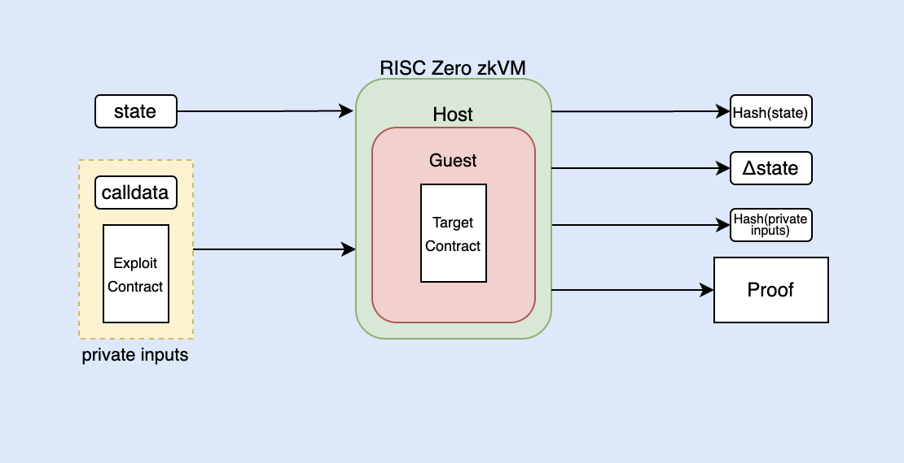

We are thrilled to share the recent success of a groundbreaking project, zkPoEX (Zero-Knowledge Proof of Exploit), which won 1st place in the ETHDenver Hackathon DeFi Track. 
[zkPoEX](https://github.com/zkoranges/zkPoEX) enables secure collaboration between security experts and DeFi projects.

Built using RISC Zero’s zero-knowledge virtual machine (zkVM), zkPoEX is a Proof of Concept (PoC) that showcases a simple reentrancy case; 
it's an exciting application of zero-knowledge technology in the DeFi landscape.

# The Challenge in DeFi Security

Bug bounty programs in the DeFi space can be challenging to manage and maintain. They aren't always honored, and compensation for white hat hackers may not be sufficient. 
This lack of incentive can lead to unreported vulnerabilities, ultimately resulting in a less secure DeFi ecosystem.

# Enter zkPoEX: A Game-Changing Solution

zkPoEX addresses these concerns by enabling white hat hackers to report live vulnerabilities in smart contracts while maintaining the confidentiality of the exploit. 
This could allow auditors to safely generate a zero-knowledge proof of exploit without revealing the actual exploit. 
With zero-knowledge proofs, the auditor can prove that they know of a transaction that can produce an undesirable change of state in certain contracts, without revealing the specifics of the exploit.

Consequently, projects are incentivized to collaborate with auditors to fix the vulnerability, fostering a stronger relationship between hackers and project owners. 
The result is a more secure DeFi ecosystem where vulnerabilities are addressed effectively and confidentially.

# Proof of Concept: Simple Reentrancy Attack Case

To demonstrate a reentrancy attack, a basic Ethereum Virtual Machine (EVM) implementation requires the following components:

- A Target Contract
- An Exploiter Contract
- A Caller address (Externally Owned Account)

To execute the attack, the Caller address sends a transaction with calldata to the Exploiter Contract, which in turn interacts with the Target Contract and repeatedly calls back to the Exploiter Contract to reduce its balance. 
This exploits a flaw in the Target Contract's code that allows reentrancy.

## Inside the RISC Zero zkVM 

To execute the attack within the RISC Zero zkVM environment, a Rust-based EVM implementation is required. 
For this proof of concept, zkPoEX has selected SputnikVM as the implementation of choice.

## Architecture

The Host requires private inputs like the calldata being sent by the Caller and the bytecode of the Exploiter Contract, as well as public inputs like the global state of the blockchain, which includes information such as the gas price, chain ID, and the state of every account that's involved in the transaction, including nonce, balance, storage, and code.

The interaction within the EVM is defined by the Guest, which involves a single transaction from the Caller to the Exploiter Contract. 
Constraints are enforced in the Guest: success of the transaction and the use of different addresses for the Caller, Target, and Exploiter Contracts. 
The Host shares private inputs with the Guest, which it then uses to execute the transaction. 
The Prover, acting as a white hat hacker, provides both the public and private inputs and performs the method execution.

## Outcomes

After the execution the receipt is generated, which can be used to verify the validity of the computation and results. 
The journal contains committed information such as the hash of the public state, change state such Target Contract balance decrease, and a commitment of the private input, that is, a hash of those private inputs.

Once the execution is completed, a receipt is generated, which can be used to verify the validity of the computation and results. 
The journal includes committed information, which consists of the hash of the public state, changes made to the state, such as a decrease in the balance of the Target Contract, and a commitment to the private inputs, represented by their hash.

As a result of the versatile design of the zkVM it should be noted that:
State change outputs may be customized or enforced according to specific requirements.
For a more general approach, the Target Contract can be treated as a public input.
The constraint system within the Guest can be made more complex, depending on the specific use case.

Running the PoC required zkPoEX’s team to reduce the number of interactions between the Exploiter and Target Contracts to reduce the amount of computation. 
That led to approximately 16GB RAM requirement and 4 minutes runtime using an Apple M1 Max with 10-core CPU and 32-core GPU.

# zkPoEX and RISC Zero

Thank you to the zkPoEX team to collaborating with us to ensure this post was accurate

zkPoEX was developed by [@zkoranges](https://twitter.com/zkoranges) and [@feder.eth](https://twitter.com/feder_eth) with acknowledgements to Daniel Lumi for advisory and Maciej Zieliński for his insightful [blog post](https://odra.dev/blog/evm-at-risc0/) on EVM inside the RISC Zero zkVM. 

zkPoEX's success in the ETHDenver hackathon DeFi track demonstrates the potential for zero-knowledge proof technology in securing the DeFi ecosystem. 

The RISC Zero zkVM, with its ability to facilitate the creation and verification of zero-knowledge proofs, is uniquely positioned to power innovative applications like zkPoEX.

We, at RISC Zero, are committed to driving innovation in the field of zero-knowledge proof technology and expanding its use cases across industries. 
We look forward to contributing to the future of DeFi security and continuing our collaboration with projects like zkPoEX to ensure a safer and more robust financial ecosystem for everyone.

Stay tuned for more updates on the RISC Zero zkVM and its groundbreaking applications, and don't hesitate to reach out if you have any questions or would like to explore collaboration opportunities.

To find more info about zkPoEX: 
- Github: https://github.com/zkoranges/zkPoEX
- Twitter: https://twitter.com/zkpoex
- [ETHDenver Presentation](https://www.youtube.com/watch?v=c_s75S8ptyU&t=3965s)